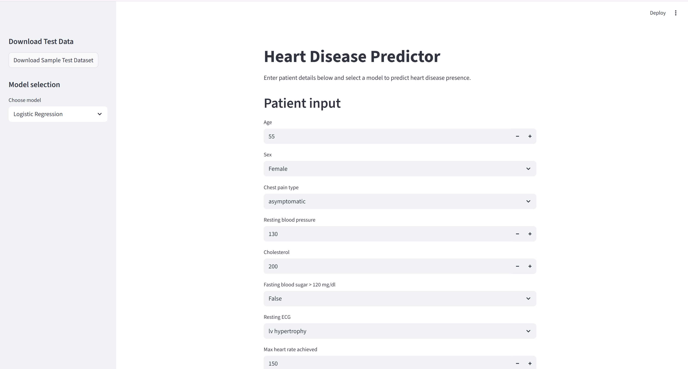
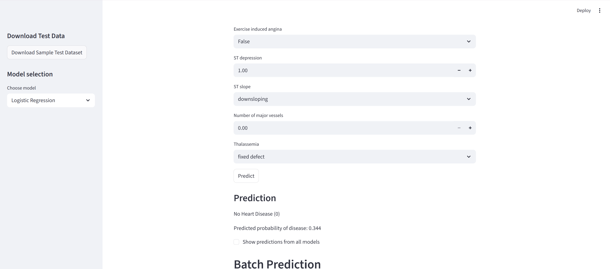
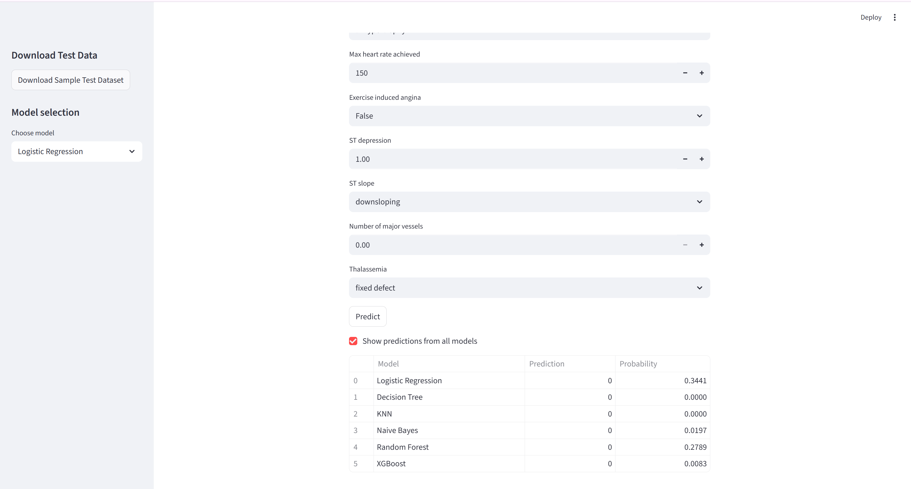
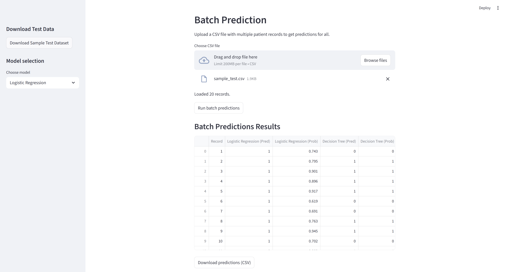

# ML Classification — Heart Disease Prediction

## Problem statement

Predict whether a patient has heart disease (binary classification) using clinical and diagnostic features from the provided `heart.csv` dataset.

## Dataset description

- Source: https://www.kaggle.com/datasets/redwankarimsony/heart-disease-data
- File: `data/heart.csv`
- Total samples: 900
- Features: 15 (age, sex, chest pain type, resting blood pressure, cholesterol, fasting blood sugar, resting ECG, max heart rate, exercise-induced angina, ST depression, ST slope, number of major vessels, thalassemia, etc.)
- Target: `num` (converted to binary: 0 = no disease, 1 = disease)
- Train/test split: 80/20 stratified (720 training, 180 test)

## Models used and evaluation metrics

Implemented models (all trained on the same preprocessed dataset):
- Logistic Regression
- Decision Tree Classifier
- K-Nearest Neighbors (k=5)
- Gaussian Naive Bayes
- Random Forest (ensemble)
- XGBoost (ensemble)

Evaluation metrics computed for each model: Accuracy, AUC, Precision, Recall, F1, MCC.

Comparison table (results on the test set):

| ML Model Name       | Accuracy | AUC     | Precision | Recall  | F1      | MCC    |
|---------------------|----------:|--------:|----------:|--------:|--------:|-------:|
| Logistic Regression | 0.8111   | 0.9006 | 0.8283   | 0.8283 | 0.8283 | 0.6184 |
| Decision Tree       | 0.7667   | 0.7821 | 0.7879   | 0.7879 | 0.7879 | 0.5286 |
| kNN                 | 0.8333   | 0.8997 | 0.8710   | 0.8182 | 0.8438 | 0.6670 |
| Naive Bayes         | 0.8278   | 0.8824 | 0.8469   | 0.8384 | 0.8426 | 0.6525 |
| Random Forest (Ensemble) | 0.8389   | 0.9224 | 0.8571   | 0.8485 | 0.8528 | 0.6749 |
| XGBoost (Ensemble)  | 0.8444   | 0.9029 | 0.8381   | 0.8889 | 0.8627 | 0.6852 |

## Observations on model performance (short analysis)

| ML Model Name       | Observation about model performance |
|---------------------|-------------------------------------|
| Logistic Regression | Simple and works well as a baseline. Easy to understand and good when relationships are roughly linear. |
| Decision Tree       | Easy to visualize but can overfit the training data, so it may not work well on new data. |
| kNN                 | Predicts from nearby examples; works well for similar cases but needs feature scaling and can be slow with large datasets. |
| Naive Bayes         | Very fast and simple; works well with small data but assumes features are independent. |
| Random Forest (Ensemble) | Builds many trees and averages them; usually more stable and gives strong, reliable results. |
| XGBoost (Ensemble)  | A powerful boosted-tree method that often gives top accuracy; can be tuned for best results but is slower to train. |

## Test Datasets for Evaluators

The project includes ready-to-use test data in the `data/` folder:

- `sample_test.csv` — Pre-loaded test dataset with 20 patient records (tab-separated; evaluators can download from the Streamlit UI).

### Using the Streamlit App for Evaluation

**Starting the app:**
```bash
streamlit run streamlit_app.py
```

**Features available to evaluators:**

1. **Individual Prediction** (Single Patient Input)
   - Enter patient details via form inputs
   - Select a model from the sidebar
   - Click "Predict" to get a prediction with probability

2. **Compare All Models** (Checkbox)
   - View predictions from all 6 models side by side
   - Compare probabilities and decisions across models

3. **Download Test Dataset** (Sidebar Button)
   - Click "Download Sample Test Dataset" button
   - Downloads `sample_test.csv` in standard CSV format

4. **Batch Prediction** (Multiple Records)
   - Upload your own CSV file with patient records
   - App processes all records and returns predictions from all models
   - Download results as CSV containing predictions for all 6 models

**Sample CSV format for batch upload:**
```
age,sex,cp,trestbps,chol,fbs,restecg,thalch,exang,oldpeak,slope,ca,thal
57,Male,asymptomatic,122,264,FALSE,lv hypertrophy,100,FALSE,0.0,downsloping,0,normal
55,Male,non-anginal,120,226,FALSE,lv hypertrophy,127,TRUE,1.7,downsloping,0,reversable defect
```

## Example screenshots

Example Streamlit UI screenshots (rendered from the `streamlit_app.py` UI):









## Sample inputs and expected output

Use the following sample inputs in the interactive app to reproduce the example screenshots above.

1) Example patient A (matches `streamlit_main.svg` prediction):

- `age`: 63
- `sex`: Male
- `cp` (chest pain): typical angina
- `trestbps`: 145
- `chol`: 233
- `fbs`: TRUE
- `restecg`: lv hypertrophy
- `thalch`: 150
- `exang`: FALSE
- `oldpeak`: 2.3
- `slope`: downsloping
- `ca`: 0
- `thal`: fixed defect

Expected output (example):
- Prediction (XGBoost): Heart Disease Present (1)
- Probability: ~0.85

2) Example patient B (lower risk):

- `age`: 41
- `sex`: Female
- `cp`: atypical angina
- `trestbps`: 130
- `chol`: 204
- `fbs`: FALSE
- `restecg`: normal
- `thalch`: 172
- `exang`: FALSE
- `oldpeak`: 0.0
- `slope`: upsloping
- `ca`: 0
- `thal`: normal

Expected output (example):
- Prediction (XGBoost): No Heart Disease (0)
- Probability: ~0.12

---
*End of required README content.*